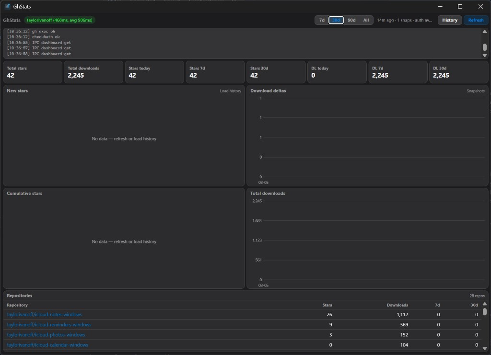

# GhStats - GitHub Stars & Downloads Analytics Desktop App

[](LICENSE)

**GhStats** is an open-source, cross-platform **desktop analytics dashboard** for your public GitHub repositories. Track stars and release download counts over time - totals, daily deltas, and rolling windows stored entirely on your machine.

Ideal for indie developers who want a lightweight **Google Analytics–style view** of GitHub engagement without shipping data to a third party.

## Features

- KPI strip: total stars / downloads, today, 7d, and 30d windows
- Time ranges: **7d · 30d · 90d · All**
- Charts: new stars per day, download deltas, cumulative stars, total downloads
- Per-repo table with stars, downloads, and 7d/30d star windows
- Local snapshots + optional star-history cache (rate-limit aware)
- Live fetch timer and rolling average timings
- Tray icon, splash screen, single-instance, window bounds persistence
- Close hides to tray (Quit from tray menu)

## Screenshots

Main analytics dashboard:



## Requirements

- [GitHub CLI](https://cli.github.com/) (`gh`) installed and authenticated (`gh auth login`)

## Development

```bash
bun install
bun run start
```

## Usage

1. Sign in with `gh auth login` if you have not already
2. Launch GhStats — it auto-fetches public repo totals on first run (and every 24h)
3. Use the range tabs (**7d / 30d / 90d / All**) to change the chart window
4. Click **Refresh** to re-pull current stars and release download totals
5. Click **History** once to backfill star timelines via `gh api stargazers` (slow; rate-limit aware)

Download charts need **multiple daily snapshots** before deltas appear. Star charts need a **History** fetch.

## Data collection

| Metric | Source | Notes |
| --- | --- | --- |
| Current stars | `gh repo list --json stargazerCount` | One API call |
| Current downloads | `gh api repos/{repo}/releases` per repo | Summed asset `download_count` (same as `ghstats`) |
| Star history | `gh api stargazers` with star timestamps | On-demand; paginated with delays |
| Download trends | Local daily snapshots | Auto-refresh every 24h; deltas computed locally |

GitHub does not expose historical download counts — only cumulative totals. Daily download charts appear after repeated snapshots over time.

Logs are written to `%APPDATA%/gh-stats/logs/gh-stats.log` (Windows) / the Electron userData folder on macOS/Linux.

## Keywords

GitHub analytics, stars over time, release downloads, gh CLI dashboard, Electron desktop app, local GitHub stats, repository metrics

## Contributing

Contributions are welcome! Please feel free to submit a Pull Request.

## License

MIT
